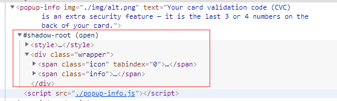

# Web Components  

## 概念  

Web Components是一个Web组件标准。  
Web Components 用来定义自定义组件（使用现有元素来封装自己的元素），可以复用而不用担心代码冲突。

## 组成

1. Custom Elements
2. Shadow DOM
3. HTML Templates
4. HTML Imports  

## 详解

### 1. Custom Elements  

一组 `Javascript API` ，允许定义 `custom Elements` 及其行为。  

* 注册

``` ts
customElements.define(
    name: string,
    class: ComponentClass,
    extendsOptions?: { extends: HTMLElement }
);
```

> 1\.name：所创建的元素的名字，不能是单个的单词，且必须有短横线 `-` 。  

2\.class：用于定于元素行为的类。  
3\. 可选参数： 指定所创建元素继承自哪个任意的内置的元素。  

* 返回自定义元素的构造函数

``` ts
    constructor = customElements.get(name);
```

> 1 name： 要返回引用的构造函数的自定义元素的名字。  

返回指定名字的自定义元素的构造函数，如果没有使用该名称的自定义元素定义，则为 `undefined` 。

* 注册时执行的回调

``` ts
    customElements.whenDefined(name);
```

> 1\.name：自定义元素的名称。  

返回：当自定义元素被定义时，一个Promise 返回 `{jsxref("undefined")}` 。如果自定义元素已经被定义，则 `resolve` 立即执行。如果提供的 name 不是一个有效的 自定义元素名字，promise 的 `reject` 回调会接收到一个 `SyntaxError` .

* 两种 `custom elements` 
1. Autonomous custom elements  

是独立的元素，它不继承自其他内建的 `HTML` 元素。可以以标签的形式引用 `<simp-sample></simp-sample>` 或者 `document.createElement('simp-sample')` 

2. Customized built-in elements

继承自基本的 `HTML` 元素， 创建时必须指定继承自元素。使用时， 需要先写出基本的元素标签，并通过 `is` 属性指定 `custom element` 的名称。 如： `<p is="simp-sample"></p>` 或者 `document.createElement('p', { is: 'simp-sample' })` 。

* 生命周期函数  

> + connectedCallback： 当 custom element 首次被插入文档时调用。
> + disconnectedCallback： 当 custom element 在文档中删除时调用。
> + adoptedCallback： 当 custom element 被移动到新的文档时，被调用。
> + attributeChangedCallback： 当 custom element 增加，删除，修改自身属性时， 被调用。  

[自定义组件的生命周期详情MDN](https://developer.mozilla.org/zh-CN/docs/Web/Web_Components/Using_custom_elements#%E4%BD%BF%E7%94%A8%E7%94%9F%E5%91%BD%E5%91%A8%E6%9C%9F%E5%9B%9E%E8%B0%83%E5%87%BD%E6%95%B0)

示例： 因为创建自定义元素要使用 `shadow DOM` ， 所以放在一起实现。

### 2. Shadow DOM

Web components的一个重要特性是封装——可以将html标签结构、css样式和行为隐藏起来，并从页面上的其他代码中分离开来，这样不同的功能不会混在一起，代码看起来也会更加干净整洁。其中，Shadow DOM接口是关键所在，它可以将一个隐藏的、独立的DOM添加到一个元素上。

Shadow DOM允许将隐藏的DOM树添加到常规的DOM树中——它以shadow root为起始根节点，在这个根节点的下方，可以是任意元素，和普通的DOM元素一样。




> 1\.shadow host  

一个常规的 DOM 节点， 作为宿主，Shadow DOM 会被添加到这个节点上。  
2\.shadow tree  
Shadow DOM 内部的 DOM 树。  
3\.shadow boundary  
shadow DOM 的作用范围，结束后是常规 DOM 开始的地方。  
4\.shadow root  
shadow tree 的 根节点

你可以像常规 DOM 一样操作 Shadow DOM，添加子节点，添加样式，设置属性等等，但他永远不会影响到外部的元素，这也为封装提供了便利。

* shadow DOM 的使用

``` ts
    let shadow = ElementRef.attachShadow({ mode: 'open' });
    let shadow = ElementRef.attachShadow({ mode: 'closed' });
```

> open： 表示你可以通过页面中的 `javascript` 方法来获取 Shadow DOM，例如使用 `Element.shadowRoot` 属性：

``` ts
    let shadowDOM = element.shadowRoot
```

> closed：如果你将 `mode` 设置为 `closed` ， 则代表你不能使用 `Element.shadowRoot` 获得 shadow DOM 了，他将返回 `null` 。（当然你可以使用其他的方法来获取，比如在定义类的时候，留一个暴露的属性）。 

通常情况下，shadow DOM 配合 Custom Element 一起使用。对于 Shadow DOM 中的 DOM， 处理方式跟常规的 DOM 一样。

### Custom Element 与 Shadow DOM 的综合示例  

完成一个自定义组件（PopUp Info -- Autonomous custom elements ） 
此组件加入了生命周期

``` ts
    class PopInfo extends HTMLElement {
    
        // 此静态方法用于监听 组件的属性的变化
        static get observedAttributes() {
            // 数组中添加你想要监听的属性名称
            // 此例中，监听的是 img 和 text 属性
            return  ['img', 'text'];
        }
    
        constructor() {
            super();
    
            this.shadow = this.attachShadow({
                mode: 'open'
            });
    
            const wrapper = document.createElement('span');
            wrapper.classList.add('wrapper');
    
            const info = document.createElement('span');
            info.classList.add('info');
            info.textContent = this.getAttribute('text');
    
            const icon = document.createElement('span');
            icon.classList.add('icon');
            icon.setAttribute('tabindex', 0);
            const img = document.createElement('img');
            img.src = this.hasAttribute('img')
                        ? this.getAttribute('img')
                        : './images/default.png';
            icon.appendChild(img);
    
            const style = document.createElement('style');
            style.textContent = `
                .wrapper {
                    position: relative;
                }
                .info {
                    font-size: 0.8rem;
                    width: 200px;
                    display: inline-block;
                    border: 1px solid black;
                    padding: 10px;
                    background: white;
                    border-radius: 10px;
                    opacity: 0;
                    transition: 0.6s all;
                    position: absolute;
                    bottom: 20px;
                    left: 10px;
                    z-index: 3;
                }
                img {
                    width: 1.2rem;
                }
                .icon:hover + .info, .icon:focus + .info {
                    opacity: 1;
                }
            `;
    
            this.shadow.append(style, wrapper);
            wrapper.append(icon, info);
        }
    
        // 被插入文档时触发
        connectedCallback() {
            console.log('connected!');
        }
    
        // 被从文档删除时触发
        disconnectedCallback() {
            console.log('disconnected!');
        }
    
        // 每次设定属性时触发，包括第一次第一次设置属性，并且第一次 oldValue 的值是 null
        attributeChangedCallback(name, oldValue, newValue) {
            console.log( `propertyName: ${name}` );
            console.log( `oldValue: ${oldValue}` );
            console.log( `newValue: ${newValue}` );
            if (name === 'img') {
                this.shadow.querySelector('img').src = newValue;
            } else if (name === 'text') {
                this.shadow.querySelector('.info').textContent = newValue;
            }
        }
    }
```

完成一个继承组件 Customized built-in elements（ExpandingList -- Autonomous custom elements ）

``` ts
    class ExpandingList extends HTMLUListElement {
        constructor() {
            super();
    
            // ...页面的逻辑，详细请看 js 文件
        }
    }
    
    // 跟自定义元素的区别所在， 他需要声明要继承自哪个元素
    customElements.define('expanding-list', ExpandingList, {
        extends: 'ul'
    });
```

使用时，将定义的名称放在 `is` 属性中

``` html
    <ul is="expanding-list">
        <!-- 这里放入内部的元素 -->
    </ul>
```

> 注意： 不管是 **自定义的元素** 或者是 **继承元素**，他们都是继承了 HTML 的类，所以在 构造器函数 `(constructor)` 中，必须使用 `super()` 来继承父类的方法，不然会报错。  

### 3. HTML Templates

* Template  

`template` 可以准许你将重复的网页结构单独封装。例：  

``` html
    <template id="my-test">
        <p>My-test</p>
    </template>
```

上面的代码，在正常渲染 `html` 的时候是不显示在页面中的，直到你用 `js` 将他们放入 `DOM` 中。

``` ts
    const template = document.getElementById('my-test');
    const templateContent = template.content;
    document.body.appendChild(templateContent);
```

* 将 `template` 与 `web components` 一起使用  

``` ts
    customElements.define(
        'my-paragraph',
        class MyParagraph extends HTMLElement {
            constructor() {
                super();
                
                const templateContent = document.getElementById('my-paragraph').content;
    
                this.shadow = this.attachShadow({ mode: 'open' })
                                .appendChild(templateContent.cloneNode(true));
            }
        }
    )
```

``` html
    <my-paragraph></my-paragraph>

    <template id="my-paragraph">
        <style>
            p {
                color: white;
                background-color: #666;
                padding: 5px;
            }
        </style>
        <p>This is my paragraph!</p>
    </template>
```

如上方代码所示， `template` 中是可以加入样式的，并且由于 `Shadow DOM` 的特性，样式是不会影响到外层的普通元素的，所以对于封装独立的组件，效果会很好。

* 使用 `slot` （插槽）  

`slot` 槽 相当于文档中的一种占位符标记，用 `name` 属性作为标记名。  
如果在外侧有元素使用了相同的标记，那么这个槽在渲染时，将会被带有相同标记的元素所替换。如下例：  
> 根据 [MDN_slot](https://developer.mozilla.org/zh-CN/docs/Web/Web_Components/Using_templates_and_slots) 手册的说法，`slot` 不仅仅可以放在 `template` 中，放在其他元素中也是可以的， 但是经实验似乎只有在 `template` 中才好用，可能理解的有问题，有待验证。
``` html
    <template id="test-slot">
        <slot name="test-slot">1234</slot>
    </template>

    <test-slot>
        <p slot="test-slot">I just want to test the slot!</p>
    </test-slot>
```
```ts
    customElements.define(
        'test-slot',
        class TestSlot extends HTMLElement {

            constructor() {
                super();

                this.shadow = this.attachShadow({ 
                    mode: 'open' 
                }).appendChild(
                    document.getElementById('test-slot').content.cloneNode(true)
                );
            }

        }
    );
```
如上例所示（效果请运行 `index.html` 文件），发现 `template` 中的 `slot` 被 `test-slot` 中的 `p` 标签替换了。有了 `slot`， 等同于可以在自定义的组件中 插入子节点， 有点类似于 `react` 组件形式。

> 另外发现一点， 如果 `slot` 不写 `name` 属性，会将所有自定义组件中的子节点替换到 `slot` 所在的位置。 如：
```ts
    
```

