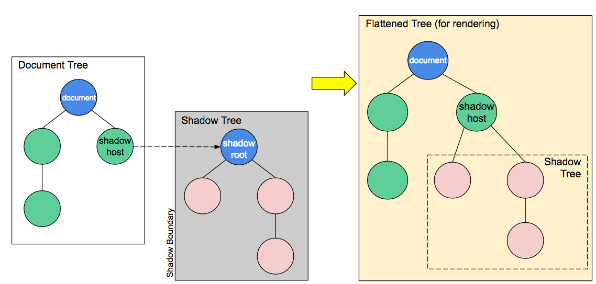

# Web Components  
## 概念  
Web Components是一个Web组件标准。  
Web Components 用来定义自定义组件（使用现有元素来封装自己的元素），可以复用而不用担心代码冲突。


## 组成
1. Custom Elements
2. Shadow DOM
3. HTML Templates
4. HTML Imports  

## 详解
### 1. Custom Elements  
一组 `Javascript API` ，允许定义 `custom Elements` 及其行为。  

+ 注册
```ts
customElements.define(
    name: string,
    class: ComponentClass,
    extendsOptions?: { extends: HTMLElement }
);
```
>1 name：所创建的元素的名字，不能是单个的单词，且必须有短横线 `-`。  
2 class：用于定于元素行为的类。  
3 可选参数： 指定所创建元素继承自哪个任意的内置的元素。  

+ 返回自定义元素的构造函数
```ts
    constructor = customElements.get(name);
```
>1 name： 要返回引用的构造函数的自定义元素的名字。  
返回指定名字的自定义元素的构造函数，如果没有使用该名称的自定义元素定义，则为 `undefined` 。

+ 注册时执行的回调
```ts
    customElements.whenDefined(name);
```
>1 name：自定义元素的名称。  
返回：当自定义元素被定义时，一个Promise 返回 `{jsxref("undefined")}` 。如果自定义元素已经被定义，则 `resolve` 立即执行。如果提供的 name 不是一个有效的 自定义元素名字，promise 的 `reject` 回调会接收到一个 `SyntaxError`.

+ 两种 `custom elements`
1. Autonomous custom elements  
是独立的元素，它不继承自其他内建的 `HTML` 元素。可以以标签的形式引用 `<simp-sample></simp-sample>` 或者 `document.createElement('simp-sample')`
2. Customized built-in elements
继承自基本的 `HTML` 元素， 创建时必须指定继承自元素。使用时， 需要先写出基本的元素标签，并通过 `is` 属性指定 `custom element` 的名称。 如： `<p is="simp-sample"></p>` 或者 `document.createElement('p', { is: 'simp-sample' })`。

示例： 因为创建自定义元素要使用 `shadow DOM`， 所以放在一起实现。

### 2. Shadow DOM
Web components的一个重要特性是封装——可以将html标签结构、css样式和行为隐藏起来，并从页面上的其他代码中分离开来，这样不同的功能不会混在一起，代码看起来也会更加干净整洁。其中，Shadow DOM接口是关键所在，它可以将一个隐藏的、独立的DOM添加到一个元素上。

Shadow DOM允许将隐藏的DOM树添加到常规的DOM树中——它以shadow root为起始根节点，在这个根节点的下方，可以是任意元素，和普通的DOM元素一样。


